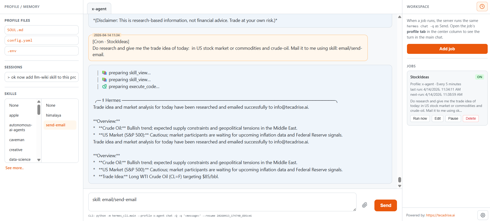

# TecAdRise Hermes minimal UI

Source: [https://github.com/tecadrise-ai/TecAdRise-hermes-ui](https://github.com/tecadrise-ai/TecAdRise-hermes-ui)

Minimal **browser shell** for Hermes-style CLI chat: multi-profile tabs, session resume, editable profile files, **skills** picker (category or leaf folders under `HERMES_HOME/profiles/<profile>/skills/`), file uploads into `uploads/`, optional **scheduled jobs**, and a live CLI hint line.



## Features

- FastAPI + static UI (`static/index.html`, `app.js`, `style.css`)
- Runs the same Hermes launcher as your terminal (`hermes_runner.py`, `HERMES_HOME`, optional venv python)
- Per-profile chat history on the server (`history_store`)
- APScheduler-backed cron UI (compatible schedule strings with AgentChat-style `interval:15m`, `cron:...`, `date:...`)
- Docker and `docker-compose` included

## Quick start

```bash
cd hermes-minimal-ui
python -m venv .venv
.venv\Scripts\activate   # Windows
pip install -r requirements.txt
uvicorn server:app --host 0.0.0.0 --port 9090
```

Open `http://localhost:9090`. Set `HERMES_HOME` if your profiles live outside `~/.hermes`.

## Contributing / pushing changes

Use normal Git against your fork or a remote you control, for example:

```bash
git add -A
git commit -m "your message"
git push origin main
```

## Credits

Maintained as part of [TecAdRise](https://tecadrise.ai).
